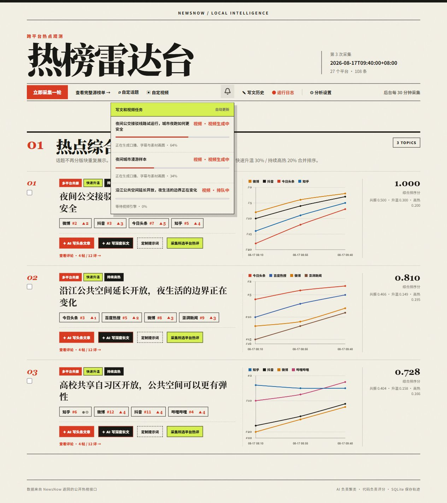
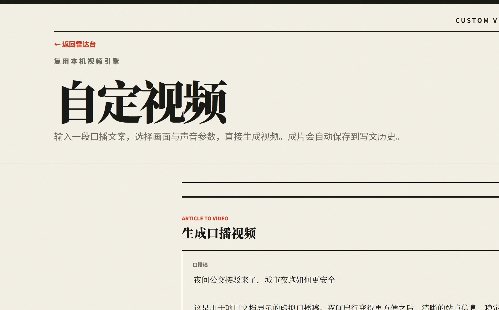

<div align="center">
  
  <h1>NewsNow 热榜雷达台</h1>
  <p><strong>从热点发现，到文章和口播视频的一站式本地内容工作台</strong></p>
  <p>跨平台热榜 → AI 事件聚类 → 热评研究 → 可编辑文章 → 串行视频成片</p>
  <p>
    <a href="https://github.com/hemashishi12/newsnow-hotspot/releases"></a>
    <a href="https://www.python.org/"></a>
    <a href="https://www.microsoft.com/windows"></a>
  </p>
</div>

NewsNow 热榜雷达台面向新闻研究、内容创作和短视频工作流：它持续采集 NewsNow 的多平台热榜，用 AI 将不同平台上的同一事件聚合成话题，再把话题、新闻来源和高赞评论交给文章与视频生产流程。所有任务、文章、修订和队列状态都保存在本机 SQLite 中。

## 界面预览

下面的截图使用项目当前版本的真实 Flask 模板、CSS、图表和交互组件；截图中的热点、文章、任务编号、进度和评论全部是虚拟样本数据，不代表真实事件，也不会连接用户的 AI、NewsNow、MediaCrawler、素材平台或视频引擎。






## 能做什么

| 模块 | 能力 |
| --- | --- |
| 热点雷达 | 聚合 27 个热榜源，按多平台共振、快速升温、持续高热生成综合榜单，并查看历史名次趋势。 |
| AI 写作 | 一键生成头条文章或深度长文；没有评论时可先采集热评，再自动继续写作。 |
| 评论研究 | 通过 MediaCrawler 采集抖音、微博、B 站、知乎等平台的帖子和一级评论，按话题串行调度。 |
| 自定义话题 | 用 Google News RSS、Bing 和可选的 SearXNG 搜索新闻，保存为独立话题继续处理。 |
| 写文历史 | 使用本地 Vditor 编辑器原地修改文章，支持自动保存、修订记录、冲突检测、图片和导出。 |
| 批量生产 | 批量生成文章或深度长文；“批量生成视频”会先生成标准文章，再自动排队生成视频。 |
| 口播视频 | 基于 MoneyPrinterTurbo 生成 9:16、16:9 或 1:1 视频，支持素材来源、字幕、语速和多种配音方式。 |
| 本地运行 | 定时采集、后台任务通知、SQLite 持久化、Windows 登录自启动和失败后恢复。 |

## 快速开始

### 运行环境

- Windows 10/11、PowerShell 和 Git
- Python Launcher `py`，主项目使用 Python 3.12
- 一个兼容 OpenAI `/chat/completions` 的 AI 接口

### 安装主项目

```powershell
git clone https://github.com/hemashishi12/newsnow-hotspot.git
Set-Location .\newsnow-hotspot
.\setup.ps1
```

`setup.ps1` 会创建 `.venv`、安装 `requirements.txt` 中的 Flask、APScheduler、httpx、PyYAML、Selenium 等依赖，并从 `.env.example` 创建本机 `.env`。

编辑 `.env`：

```dotenv
AI_API_KEY=你的密钥
AI_BASE_URL=https://api.openai.com/v1
AI_MODEL=gpt-4.1-mini
```

启动网页：

```powershell
.\run.ps1 serve
```

打开 <http://127.0.0.1:8765>。服务启动后会按配置定时采集；关闭浏览器不会停止后台任务。

## 按功能安装依赖

不是所有功能都需要下载全部开源项目。主项目依赖由 `setup.ps1` 安装，其他组件按需安装。

| 功能 | 需要的组件 | 安装方式 |
| --- | --- | --- |
| 热榜采集和榜单分析 | 本项目 Python 依赖、AI API | `setup.ps1` 自动安装；AI Key 写入本机 `.env`。 |
| 文章编辑和趋势图 | Vditor、Chart.js | 已随仓库放在 `static/vendor/`，不依赖公共 CDN。 |
| 热评采集 | [MediaCrawler](https://github.com/NanmiCoder/MediaCrawler) | 需要单独安装到项目相邻目录 `mediacrawler`，并按上游说明创建它自己的 `.venv`；还需要浏览器登录相关平台。 |
| 口播视频 | [MoneyPrinterTurbo](https://github.com/harry0703/MoneyPrinterTurbo) | 运行 `.\setup-video-engine.ps1`，脚本会固定下载经过验证的版本、创建 Python 3.11 环境并安装依赖。 |
| 视频素材 | Pexels、Pixabay 或 Coverr API | 在“分析设置”中填写对应 Key，每次生成选择一个素材来源。 |
| 外部配音 | OpenAI 兼容 TTS 或 GPT-SoVITS | 可选；需要用户自己运行或提供对应接口。 |
| 更多新闻搜索 | SearXNG | 可选；在本机运行后，在 `.env` 配置 `SEARXNG_URL`。 |

### 安装评论采集

评论采集不是主项目的内置依赖。当前服务默认在项目旁边查找以下结构：

```text
parent-folder/
├─ newsnow-hotspot/
└─ mediacrawler/
   ├─ main.py
   └─ .venv/
      └─ Scripts/python.exe
```

请先参考 [MediaCrawler 的安装说明](https://github.com/NanmiCoder/MediaCrawler)，再在 NewsNow 页面“分析设置”中选择需要采集的平台。平台登录态保存在 MediaCrawler 自己的本机目录中，不会提交到本仓库。

### 安装视频引擎

```powershell
Set-Location .\newsnow-hotspot
.\setup-video-engine.ps1
```

脚本会把 MoneyPrinterTurbo 安装在项目相邻目录，并在第一次生成视频时自动启动本机引擎。视频任务会进入 SQLite 队列，按创建顺序一次执行一个；服务重启后会恢复未完成任务，避免多个视频同时改写引擎配置。

## 常用操作

```powershell
# 启动网页和定时采集
.\run.ps1 serve

# 手动采集并执行 AI 分析
.\run.ps1 collect

# 只采集原始榜单，不调用 AI
.\run.ps1 collect -NoAI

# 对最近一次采集重新执行 AI 分析
.\run.ps1 analyze
```

网页中的典型流程：

1. 在热点雷达中选择话题，查看跨平台来源和趋势。
2. 采集热评，或直接生成头条文章/深度长文。
3. 在写文历史中编辑、修订、导出文章。
4. 点击“生成视频”，选择画面比例、素材来源、字幕和配音。
5. 在通知中心查看排队进度，在写文历史中预览或下载 MP4。

批量生成视频的顺序固定为：

```text
选中多个话题 → 逐个生成标准文章 → 文章完成 → 加入视频队列 → 逐个生成 MP4
```

## 配置说明

### AI 接口

AI 配置从 `.env` 读取，也可以在网页设置中调整。项目兼容提供 `/chat/completions` 的 OpenAI 格式接口；文章生成会把话题新闻、来源链接、帖子和热评作为引用资料发送给模型。

### 热榜和评分

`config.yaml` 保存 27 个来源、平台权重、采集间隔和评分门槛。网页设置可以覆盖分析平台、采集间隔和三项榜单权重。原始榜单会先写入 SQLite；即使 AI 请求失败，原始数据仍然保留。

### 视频与配音

- 视频比例：9:16、16:9、1:1。
- 素材来源：Pexels、Pixabay、Coverr。
- 配音方式：MoneyPrinterTurbo 内置 TTS、OpenAI 兼容 TTS、GPT-SoVITS。
- 外部配音可以生成音频后交给 MoneyPrinterTurbo 继续完成素材、字幕和合成。
- API Key 只保存在本机 `.env` 或 SQLite 设置中，不会出现在任务 API 响应里。

## 数据、隐私与日志

- 本项目默认只监听 `127.0.0.1`，不提供公共账号系统。
- `.env`、`.venv`、`data/`、日志和生成文件都被 `.gitignore` 排除，不应提交到 Git。
- SQLite 数据库位于 `data/hotspots.db`，包含热榜、文章、评论、修订和任务状态。
- 文章图片保存在 `data/article-images/`；视频和外部配音缓存位于相邻 MoneyPrinterTurbo 的 `storage/`。
- 后台日志位于 `data/logs/`。需要 Windows 登录后运行时，可执行 `install-autostart.ps1`。

## 注意事项

- NewsNow 提供的是各站热榜，不是事实核验结果；跨平台热度不能替代可靠信源。
- 社交平台评论采集可能需要扫码登录，并受平台规则、频率限制和账号状态影响。
- Pexels、Pixabay、Coverr 的素材使用必须遵守各自的许可证、署名和 API 条款。
- 视频生成需要额外的 CPU/GPU、磁盘空间和网络时间，首次安装或首次使用可能下载较多依赖和模型。

## 相关项目

- [NewsNow](https://github.com/ourongxing/newsnow)：热榜数据来源。
- [MediaCrawler](https://github.com/NanmiCoder/MediaCrawler)：社交平台帖子和评论采集。
- [MoneyPrinterTurbo](https://github.com/harry0703/MoneyPrinterTurbo)：本地口播视频合成引擎。
- [Vditor](https://github.com/Vanessa219/vditor)：本地 Markdown 编辑器资源。

## License

本项目当前未附统一的项目许可证。仓库内的 Vditor、Chart.js 及其他第三方组件保留各自许可证；使用或再发布前请阅读对应许可证文件和上游项目条款。
